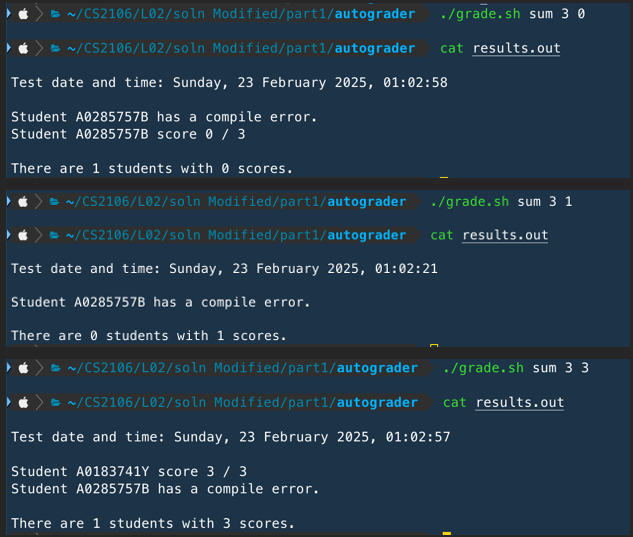

# Lab 2

#### Comments from previous lab
Section 2:
`w` is a **static local variable**, which means it:
* Is a **local** variable (can't access it from outside its scope)
* Is stored in the **data segment** (won't lose data when the function returns and its stack frame gets cleared)
    * this can be observed from the fact that `w`'s address is close to that of the global variables
> When we declare a global variable as static, it prevents the variable from being accessed by other source files, even if they use the “extern” key-word. For local variables, the static keyword allows functions to retain values even after it exits.
#### Demo Instructions
Run the shell script and `cat` the results as follows:

